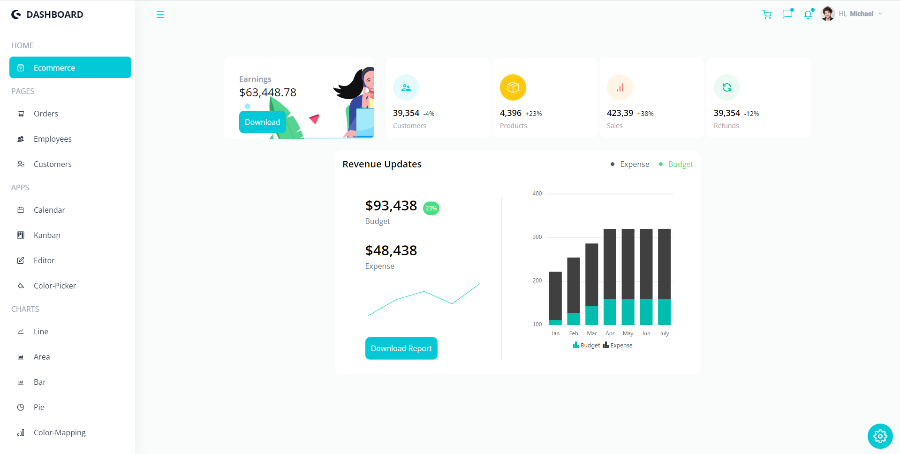

# DASHBOARD for Teams, E-Commerce and Finance

   

## This is a broswer dashboard for charts analysis, product orders and sales organization, and team workflow. All in one.

### Description

Welcome to DASHBOARD! This a frontend browser application the users will be able to manage expenses and revenues, keep track of employees, customers, and product orders of their business, and display data in several types of charts for different analysis.

I wanted to improve my React skills that I learned in bootcamp, and this application fitted that goal in different aspects of development. This project was possible thanks to Adrian Hajdin a.k.a.
JavaScript Mastery ([Youtube Channel](https://www.youtube.com/c/JavaScriptMastery), [GitHub](https://github.com/adrianhajdin)), whose videos have helped me throughout the programming learning curve.

---

### Sections

#### PAGES

This section is focused to help in business management providing tools as follow.

##### Orders

Here the user can track the orders. Their status, the product and information about the product.

##### Employees & Customers

It's possible to have an organized space to store and manage people's information in the _Employees_ and _Customers_ section.

#### APPS

Task and time managemen, team workflow alongside with taking notes and choosing colors become easy in the section _APPS_, which includes the following fully functional and well known application respectively.

##### Calendar

##### Kanban

##### Editor

##### Color-Picker

#### CHARTS

In-depth data analysis and display information is another perk that app provides. With several types of charts to choose from, inflection points, trends, distribution patterns, and many other characteristics are more visible for the user in this section. Those charts are as follow.

##### Line

##### Area

##### Bar

##### Pie

##### Color-Mapping

##### Pyramid

##### Stacked

### Features

#### Theme Settings

Choosing purple.

 

##### Toggle Dark & Light Mode

#### Tables

##### Edit Iformation

 

##### Sort & Delete

 

##### Search & Pagination

#### Customizable

Edit events in _Calendar_.

 
